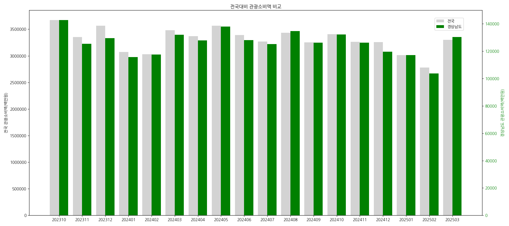
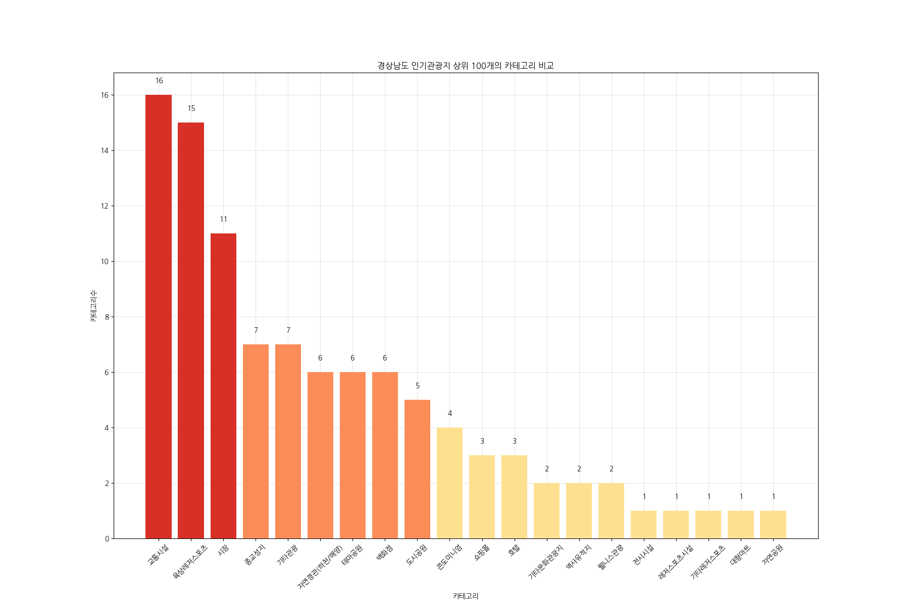
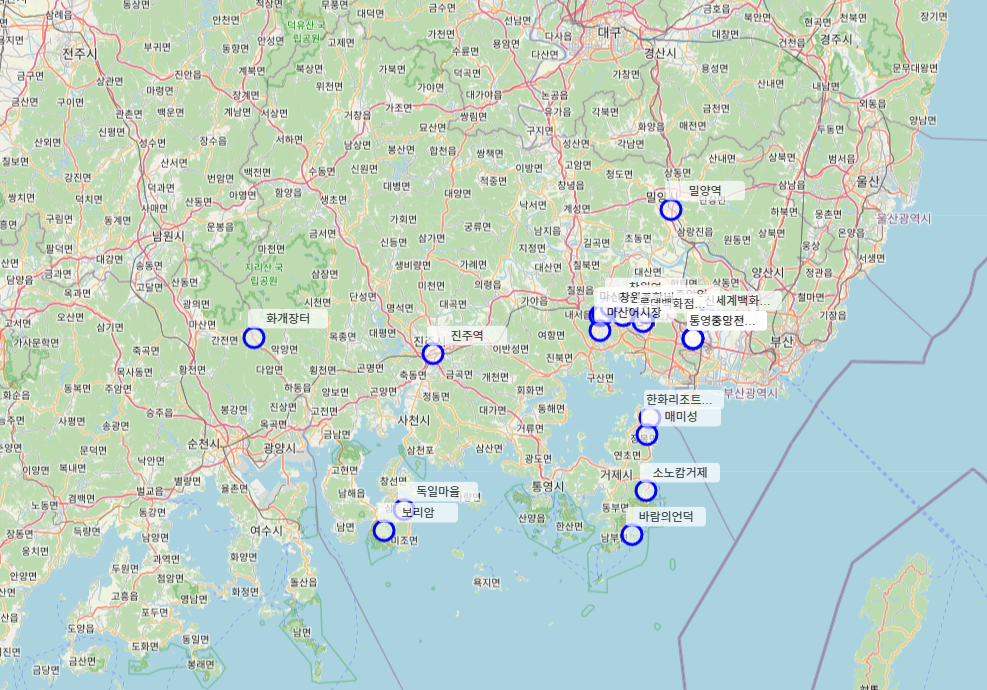

# 2025년 경상남도 빅데이터 분석 공모전
## 경남 지역의 문화 자원 불균형 문제와 대응
### 환경설정 [WSL2 + Ubuntu + JupyterLab 설치]
### 경상남도 시군별 인구수 및 세대수 분석 후 지도에 표기

### 부산과 경상남도 문화관광시설 비교 분석
### 시군별 문화관광시설수 분포 분석 후 지도에 표기

### 전국과 경상남도 관광 소비 비교

### 경상남도 인기관광지 상위 100개의 카테고리 비교 (사진사이즈 다시 조정 필요)

### 경상남도 인기관광지 상위 20개 지도 표기
